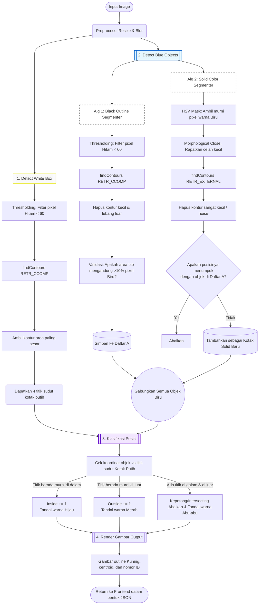

# Energeek Box Detector 📦

Sebuah *production-grade web application* yang menggunakan **Classical Computer Vision** untuk secara otomatis mendeteksi, mengklasifikasi, dan menghitung jumlah kotak biru yang berada di dalam maupun di luar dari kotak referensi utama (kotak putih).

---

## 🎯 Apa Itu Aplikasi Ini?

Aplikasi ini dibuat untuk menyelesaikan masalah inspeksi industri secara otomatis. Diberikan sebuah gambar yang berisi satu kotak utama berwarna putih dengan garis tepi hitam, serta kumpulan kotak-kotak kecil berwarna biru (baik itu kotak solid murni maupun kotak dengan tekstur bergaris/hatch).

Aplikasi akan:
1. Menemukan koordinat presisi dan kemiringan (*rotation*) dari kotak utama (putih).
2. Mendeteksi seluruh kotak biru di dalam gambar.
3. Mengkategorikan posisi kotak biru tersebut ke dalam 3 jenis:
   - **Inside** (Hijau): Murni berada di dalam batas area kotak putih.
   - **Outside** (Merah): Murni berada di luar batas area kotak putih.
   - **Intersecting / Kepotong** (Abu-abu): Objek menabrak/memotong garis batas kotak putih (sengaja diabaikan/tidak dihitung).
4. Menghasilkan *overlay image* dengan *bounding box*, titik tengah (*centroid*), label klasifikasi, dan total perhitungan.

---

## 🛠️ Teknologi yang Digunakan

Aplikasi ini sengaja dibangun dengan konsep *Full-Stack Minimal-Dependency* untuk menjaga performa tetap super cepat (*ultra-low latency*).

| Komponen | Teknologi | Alasan Pemilihan |
| :--- | :--- | :--- |
| **Backend API** | **FastAPI** (Python) | Dipilih karena sangat cepat (*async-native*), memiliki *auto-documentation* bawaan (Swagger UI), validasi data otomatis menggunakan Pydantic, dan sangat cocok untuk microservices berbasis *Machine Learning* / *Computer Vision*. |
| **Computer Vision** | **OpenCV** (`cv2`) | Menggunakan pendekatan **Classical CV** (bukan *Deep Learning*) karena karakteristik gambar memiliki kontras warna yang solid dan latar yang stabil. OpenCV mampu memproses logika *thresholding* dan pencarian kontur geometri dalam hitungan milidetik (~50ms) tanpa membutuhkan GPU yang mahal. |
| **Frontend UI** | **Vanilla HTML, CSS, JS** | Tidak menggunakan framework berat seperti React/Vue. Didesain dalam 1 file `index.html` saja dengan *Vanilla JS* untuk mempermudah operasional dan meminimalisir *setup*. Tampilan menggunakan estetika modern (Glassmorphism, transisi halus) secara murni dengan CSS Variables. |

---

## ⚙️ Cara Menggunakan Aplikasi (Usage Guide)

### 1. Clone Repository
Pertama, salin kode program ini ke komputer Anda dan masuk ke dalam direktorinya:
```bash
git clone https://github.com/your-repo/energeek-box-detector.git
cd energeek-box-detector
```

### 2. Install Dependencies
Pastikan Anda memiliki Python 3.10 atau versi di atasnya terinstall. Instal pustaka yang dibutuhkan menggunakan `pip`:
```bash
pip install -r requirements.txt
```

### 3. Jalankan Server (Syntax Run)
Gunakan Uvicorn untuk menjalankan FastAPI backend. Syntax di bawah ini akan menjalankan server di port 8000 dan mengaktifkan mode *auto-reload* untuk *development*.
```bash
uvicorn app.main:app --reload --port 8000
```

### 4. Buka Frontend Web UI
Setelah server menyala (ditandai dengan pesan `Application startup complete` di terminal), buka browser Anda dan akses:
> 👉 **http://localhost:8000/**

### 5. Cara Penggunaan Web UI
1. Anda akan melihat halaman antarmuka (*dashboard*).
2. Di kotak sebelah kiri, Anda bisa melakukan **Drag & Drop** file gambar atau klik untuk memilih gambar (file harus berupa format `.png`, `.jpg`, atau `.jpeg`).
3. Gambar akan langsung terproses. Di layar sebelah kanan, Anda akan mendapatkan kalkulasi hitungan (Inside, Outside, Total) dan gambar visualisasi hasilnya lengkap dengan warna anotasi (Hijau, Merah, Abu-abu).

---

# Computer Vision Pipeline Flowchart

Diagram di bawah ini mengilustrasikan urutan proses (*flowchart*) bagaimana gambar yang Anda *upload* diproses oleh sistem OpenCV dari awal hingga akhir, dengan penekanan pada **Hybrid Pipeline** yang baru saja kita buat.



## Penjelasan Singkat
1. **Detect White Box (`white_box.py`)**: Ini adalah langkah pertama. Sistem mutlak harus mengetahui di mana batas reference areanya terlebih dahulu.
2. **Detect Blue Objects (`blue_box.py`)**: Di sinilah *Hybrid Pipeline* bekerja.
   - **Algoritma 1** mencari area yang **dibungkus oleh garis hitam** lalu mengecek isinya. Ini sangat akurat untuk kotak jenis *hatch/stripe*.
   - **Algoritma 2** murni mencari area **berwarna biru** lalu mengecek apakah area itu belum terdeteksi. Ini jaring pengaman (*safety net*) yang sangat akurat untuk kotak solid tanpa garis luar.
3. **Klasifikasi Posisi (`classifier.py`)**: OpenCV menggunakan `pointPolygonTest` untuk memeriksa apakah koordinat titik-titik dari kotak biru berada di dalam polygon (kotak putih) atau di luar. Jika sebagian titik di dalam dan sebagian di luar, maka dipastikan objek tersebut **memotong** garis referensi.
4. **Render Gambar Output (`visualize.py`)**: Berbekal data koordinat dan status klasifikasi, sistem menggambar ulang poligon dan titik tengah (*centroid*) di atas *copy* dari gambar asli Anda, mengubahnya ke format `base64`, lalu mengirimkannya ke layar browser Anda.


---

> Dibuat untuk menyelesaikan inspeksi visual secara praktis dan sangat efisien! 🚀
